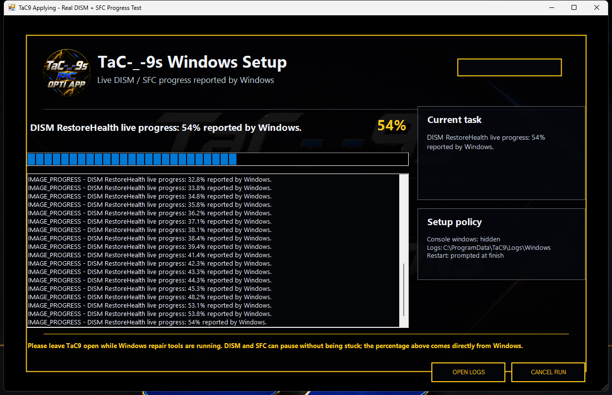

# TaC-_-9s PC Optimization Suite

TaC-_-9s PC Optimization Suite is an all-in-one Windows app made for gaming PCs, fresh Windows installs, and anyone who wants an easier way to optimize their PC or install the TaC9 Call of Duty configuration.

Everything is together in one launcher so you do not have to search through folders for each tool.

## Latest Update: 11.2.0.51

- Fixed DISM and SFC reaching completion in PowerShell without the Windows app showing their final finished state
- Added the missing live-output reader to direct Windows Image Repair and hardened the same completion path used by TaC9 Personal Settings
- DISM and SFC now stay at 100% while TaC9 captures the final Windows result, with no 100-to-99 fallback during finalization
- Added reliable process-exit waits, final output draining, and protection against partially written final progress records
- Verified the corrected monitor with real DISM RestoreHealth, SFC scannow, DISM CheckHealth, and SFC verify-only runs
- Fixed Apply NPI Profile Only reusing an older cached NVIDIA Profile Inspector 3.0.2.1 executable
- The suite now compares cached and bundled NPI versions, replaces older Desktop copies with 3.0.2.2, and verifies the copied executable before importing the profile
- Apply NPI Profile Only now stops with a clear error if the replacement cannot be verified instead of silently falling back to an older engine
- Updated NVIDIA Profile Inspector from 3.0.2.1 to the verified official 3.0.2.2 release asset
- Kept the approved 616.56 NVIDIA profile byte-for-byte unchanged during the engine update
- Updated the in-app GPU tool updater to use the approved v3.0.2.2 tag and verify its official SHA-256 digest
- Updated the standalone TaC9 Toolbox to 2.2.0.1 while keeping its existing 610.88 NVIDIA profile unchanged
- Fixed the completion-window error that appeared when every discovered leftover was safely excluded and there were zero removable items
- Added a tested zero-item summary contract so safe empty scans finish normally with `Refused: 0`
- Advanced leftover cleanup is now limited to high-confidence app-owned files, folders, and shortcuts
- Registry entries, services, scheduled tasks, Windows components, drivers, shared runtimes, and Microsoft package data are never removed by leftover cleanup
- Replaced unrestricted leftover selection with Select Safe and added a second safety check immediately before deletion
- Added one COD Config Installer with separate BOPS7 and MW4 modes
- Added MW4 support for both Xbox App and Battle.net, including exact store-specific shader-cache detection
- Refreshed the embedded BOPS7 and MW4 player configuration files
- Added a shared first-seen MW4 backup so changing platforms cannot replace the customer's original backup with an already-modified file
- Added strict platform-aware path checks that refuse Xbox and Battle.net shader-cache paths in the wrong mode
- Fixed Personal Settings so Explorer-related changes no longer open repeated This PC windows; the shell-only refresh is safely deferred until the required restart
- Fixed Fresh Open ISLC and Open ISLC so a saved start-minimized setting cannot leave the real ISLC window hidden
- Updated ISLC free-memory presets to 15000 MB for 32 GB RAM and 30000 MB for 64 GB RAM
- Moved Check for Updates onto the same aligned row as Save Key, Show HWID, and Clear Key
- Replaced the retired NVIDIA profile with the approved 616.56 full-driver profile
- Added an Apply NPI Profile Only button beside Automatic Normal Install in the GPU app
- Clean first visible frame for both the protected suite and Windows Optimization App
- Full launcher and Windows card layouts are prepared before either window is revealed
- Removed automatic startup warning popups and competing first-launch layout passes
- Guarded app buttons that prevent accidental duplicate launches
- Faster Windows system information and incremental live-setting checks
- Smoother scrolling and repainting in the Windows Optimization App
- Real Windows-reported DISM RestoreHealth and SFC /scannow percentages
- A redesigned progress window with wrapped, aligned text at standard and minimum sizes
- Reliable Personal Settings worker exit codes, saved diagnostics, and full process-tree cancellation
- Restart remains opt-in and requires an explicit Yes selection

## Included Apps

### Windows Optimization App

Windows performance settings, cleanup tools, repair options, services, networking, storage, input, graphics, and power settings.

### GPU Optimization App

A step-by-step NVIDIA setup with GPU detection, clean driver guidance, NVIDIA Profile Inspector, the 616.56 profile, and a dedicated profile-only apply button.

### ISLC Setup App

Helps install and set up ISLC with RAM-specific presets and reliable foreground opening even when ISLC is configured to start minimized.

### Debloat App

Finds installed applications and removable Windows apps and lets you choose what you want to uninstall. After the normal uninstallers finish, TaC9 can scan all selected apps together for high-confidence leftover files, folders, and shortcuts.

The advanced review window includes Select Safe and Clear controls. Shared or uncertain matches remain unselected, duplicate results are combined, and every selected item is checked again before deletion. Windows components, Microsoft package data, drivers, shared runtimes, installer data, registry entries, services, scheduled tasks, and TaC9 runtime files are protected.

### COD Config Installer

The installer now has separate **BOPS7** and **MW4** buttons. Both modes support Xbox App and Battle.net, replace only the two matching player configuration files, clear only the selected installation's validated shader-cache folder, and preserve the customer's first-seen originals for one-click restore. The utility is included in the suite and does not require a suite license key.

- BOPS7 player files: `%LOCALAPPDATA%\Activision\Call of Duty\players`
- MW4 player files: `%LOCALAPPDATA%\Activision\Call of Duty\playersBeta`
- MW4 Xbox shader cache: `XboxGames\Call of Duty- Modern Warfare 4- Beta\Content\cod26\shadercache`
- MW4 Battle.net shader cache: `Call of Duty\_beta_\cod26\shadercache`

The MW4 Xbox and Battle.net modes intentionally share one original-file backup because both stores use the same `playersBeta` destination. Unrelated player files are left alone, and a path that does not match the selected game and platform is refused before any file is changed.

## Features

- One TaC-_-9s launcher for all five apps
- Saves your license key
- Windows and system information
- Gaming and performance options
- Windows repair and cleanup tools
- Live DISM and SFC repair percentages reported directly by Windows
- NVIDIA optimization guide
- ISLC setup options
- Windows app debloat and cleanup
- Reviewed multi-app file, folder, and shortcut cleanup with duplicate detection and strict safety exclusions
- Apply-time refusal checks for protected, shared, system, registry, service, and scheduled-task items
- BOPS7 and MW4 configuration installer for Xbox App and Battle.net
- Guarded Call of Duty shader-cache cleanup and original-file restore
- Check for Updates button
- TaC-_-9s themed interface and icons

## Quick Install

Open PowerShell and run:

```powershell
irm https://raw.githubusercontent.com/Tac-9-Pc-Optimizations/TaC9-Optimization-App/main/win.ps1 | iex
```

This downloads the newest TaC-_-9s app, creates a Desktop shortcut, and opens it.

## Manual Download

[Download the latest TaC9 PC Optimization Suite EXE](https://github.com/Tac-9-Pc-Optimizations/TaC9-Optimization-App/releases/latest/download/TaC9-PC-Optimization-Suite.exe)

Run the app as Administrator after downloading it.

[Download the standalone TaC9 Toolbox EXE](https://github.com/Tac-9-Pc-Optimizations/TaC9-Optimization-App/releases/latest/download/TaC9-Toolbox-Standalone.exe)

## How to Use

1. Download or install the app.
2. Run the app as Administrator.
3. Enter and save your license key for the licensed optimization apps. The COD Config Installer and Socials buttons do not require it.
4. Choose the app you want to use.
5. Follow the steps and descriptions inside each app.

## Important

- Always run the app as Administrator.
- Some Windows changes may require a restart.
- Create a restore point before making major system changes.
- The GPU app is made for NVIDIA GPUs.
- Close Call of Duty before installing, restoring, or clearing its shader cache.
- Read the descriptions before applying settings or removing apps.

## Support

For purchases, license help, HWID resets, or support, make a ticket in the TaC-_-9s Discord.

## Screenshots


### Live DISM and SFC Progress



### COD Config Installer


