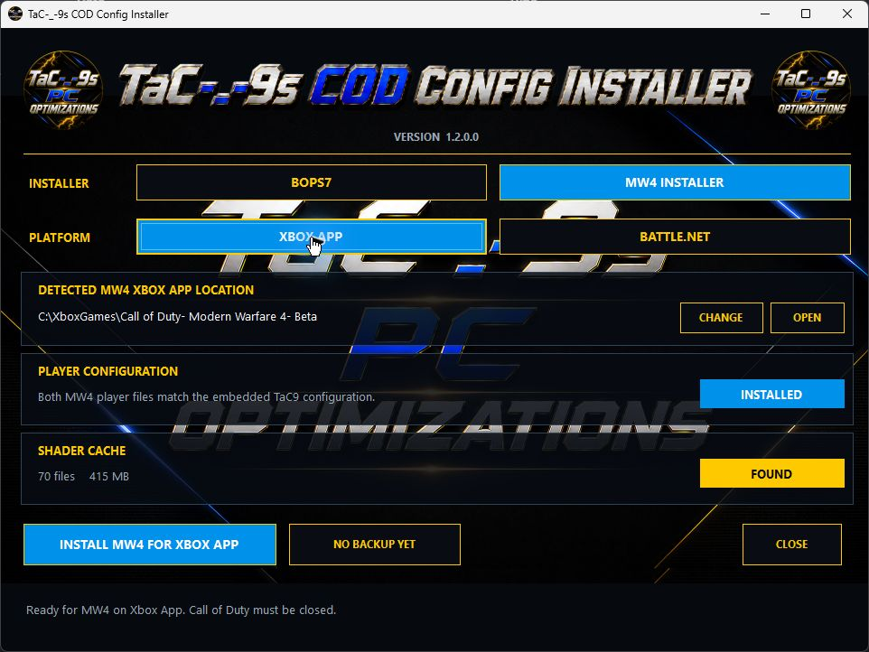

# TaC-_-9s PC Optimization Suite

TaC-_-9s PC Optimization Suite is an all-in-one Windows app made for gaming PCs, fresh Windows installs, and anyone who wants an easier way to optimize their PC or install the TaC9 Call of Duty configuration.

Everything is together in one launcher so you do not have to search through folders for each tool.

## Included Apps

### Windows Optimization App

Windows performance settings, cleanup tools, repair options, services, networking, storage, input, graphics, and power settings.

### GPU Optimization App

A step-by-step NVIDIA setup with GPU detection, clean driver guidance, NVIDIA Profile Inspector, and the 610.88 profile.

### ISLC Setup App

Helps install and set up ISLC with options for different amounts of RAM.

### Debloat App

Finds Windows apps and system components and lets you choose what you want to remove. After the normal uninstallers finish, TaC9 can scan all selected apps together for leftover files, folders, shortcuts, registry entries, services, and scheduled tasks.

The advanced review window preselects only high-confidence owned leftovers and includes Select Recommended, Select All, and Clear controls. Shared or uncertain matches remain unchecked by default, protected Windows areas are excluded, duplicate results are combined, and registry or scheduled-task changes require a verified backup before removal.

### COD Config Installer

Installs the embedded TaC9 Call of Duty player configuration for the Xbox App or Battle.net version, clears only the selected installation's validated shader cache, and keeps a first-seen backup for one-click restore. The utility is included in the suite and does not require a suite license key.

## Features

- One TaC-_-9s launcher for all five apps
- Saves your license key
- Windows and system information
- Gaming and performance options
- Windows repair and cleanup tools
- NVIDIA optimization guide
- ISLC setup options
- Windows app debloat and cleanup
- Reviewed multi-app leftover cleanup with duplicate detection and safety exclusions
- Cleanup manifests plus required registry and scheduled-task backups
- Xbox App and Battle.net COD configuration installer
- Guarded Call of Duty shader-cache cleanup and original-file restore
- Check for Updates button
- TaC-_-9s themed interface and icons

## Quick Install

Open PowerShell and run:

```powershell
irm https://raw.githubusercontent.com/Tac-9-Pc-Optimizations/TaC9-Optimization-App/main/win.ps1 | iex
```

This downloads the newest TaC-_-9s app, creates a Desktop shortcut, and opens it.

## Manual Download

[Download the latest TaC9 PC Optimization Suite EXE](https://github.com/Tac-9-Pc-Optimizations/TaC9-Optimization-App/releases/latest/download/TaC9-PC-Optimization-Suite.exe)

Run the app as Administrator after downloading it.

## How to Use

1. Download or install the app.
2. Run the app as Administrator.
3. Enter and save your license key for the licensed optimization apps. The COD Config Installer and Socials buttons do not require it.
4. Choose the app you want to use.
5. Follow the steps and descriptions inside each app.

## Important

- Always run the app as Administrator.
- Some Windows changes may require a restart.
- Create a restore point before making major system changes.
- The GPU app is made for NVIDIA GPUs.
- Close Call of Duty before installing, restoring, or clearing its shader cache.
- Read the descriptions before applying settings or removing apps.

## Support

For purchases, license help, HWID resets, or support, make a ticket in the TaC-_-9s Discord.

## Screenshots


### COD Config Installer


